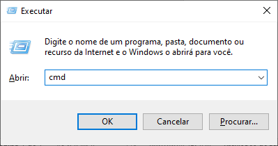
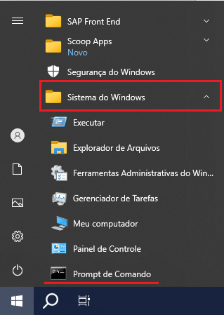
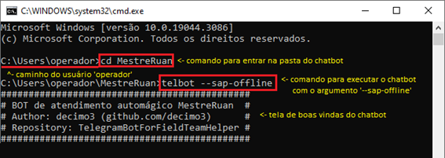

# Instruções de operação do chatbot

O arquivo `telbot.exe` pode ser executado diretamente pelo explorer, com dois cliques, usando as configurações padrões. Para alterar o comportamento do programa conforme a necessidade é necessário executar o programa **via linha de comando**.

Para executar via linha de comando, use o atalho `Inicio + R` e digite `cmd` na janela Executar.

Ou use o caminho: **Menu iniciar >> Sistema do Windows >> Prompt de Comando**.

Uma janela irá abrir com o caminho do usuário, será então necessário entrar na pasta onde o chatbot está instalado com o comando `cd MestreRuan`. Após estar na pasta do chatbot, inicie o chatbot com o comando `telbot`.

## Argumentos via linha de comando

O chatbot contém definições determinadas pelas `variáveis de ambiente`, porém para comportamento em tempo de execução são usados os argumentos fornecidos via linha de comando.

#### --em-desenvolvimento

Esse argumento fará o chatbot carregar as definições das variáveis de ambiente através do arquivo `.env`, ignorando as variáveis do sistema.

> Esse argumento só deve ser utilizado em ambiente de desenvolvimento! Não utilizar se não souber exaamente o que ele faz!

#### --sap-instancia

Esse argumento é utilizado para definir uma instancia SAP diferente da padrão (0), e deve ser usada no formato de atribuição (--sap-instancia=[número da instancia desejada]).

> Utilizar ele quando a instancia padrão do SAP não estiver disponível. Os números começam do **zero**: a primeira (1) janela do SAP é a instância zero (0), a segunda janela (2) é a instância um (1), e etc..

#### --sap-offline

Esse argumento fará o chatbot ignorar todas as solicitações recebidas, enviando uma mensagem notificando que o sistema SAP está indisponível.

> Usado quando houver problema para acessar o sistema Light, e mesmo que não tenha internet, para que as equipes estejam cientes do acontecido.

#### --sem-faturas

Esse argumento fará o chatbot trocar as solicitações de FATURA por INFORMACAO, e envia uma mensagem notificando que o sistema SAP não está gerando faturas.

> Usado quando houver problema para o sistema da Light gerar faturas, para que as equipes estejam cientes, e as informações para que peguem no LIA.

#### --sap-espera

Esse argumento é utilizado para definir o tempo de espera de uma solicitação realizada para o SAP, e deve ser usada no formato de atribuição (--sap-espera=tempo_de_espera_em_segundos).

> O tempo padrão de espera para uma solicitação é de 60 segundos. Esse parâmetro deve ser usado quando houver lentidão no sistema SAP e as solicitações estiverem demorando um pouco mais que o normal.

## Solução de problemas

#### SAP encerra a conexão (SAP caiu)

Quando o cliente do SAP fica inativo por muito tempo, o mesmo é desconectado por inatividade, o chatbot ficará parado, até a janela de confirmação ser clicada.

Para solucionar esse problema, antes de interagir com o SAP, pare a execução do chatbot, e logue novamente no SAP, depois execute o chatbot novamente.

Se a janela de erro ser dispensada, imediatamente o chatbot irá rejeitar as solicitações devido à falta de comunicação com a sessão do SAP.

#### SAP demora demais ou parou de gerar faturas:

Se o SAP estiver parado por muito tempo em uma solicitação de FATURA, pode ser que o sistema da Light de geração de faturas esteja fora do ar.

Para solucionar esse problema, pare a execução do chatbot, e inicie ele novamente com o argumento `--sem-faturas` na linha de comando.

#### SAP está fora do ar (Light toda, geral):

Estando a base com internet, se o SAP estiver fora do ar, não há o que fazer. O chatbot irá rejeitar todas as solicitações devido a falta da instância do SAP.

As equipes continuarão a solicitar a não ser que sejam informadas que o sistema SAP está fora do ar, e para isso serve o argumento `--sap-offline`, que irá informar as equipes.

#### SAP travou na instância que o chatbot usa:

Caso a janela do SAP do chatbot trave, feche o chatbot, feche todas as janelas do SAP, e inicie novamente o SAP, e depois o chatbot.

No caso de a janela não fechar pelo 'X', force o encerramento pelo gerenciador de tarefas.

Caso o SAP não esteja encerrando de forma alguma, você pode usar outra janela, iniciando o chatbot com o argumento `--sap-instancia=1` (no caso para usar a segunda janela).

#### SAP trava numa solicitação específica:

O chatbot atende uma solicitação por vez, sempre tendo que finalizar a última para atender a próxima.

Caso uma solicitação esteja demorando demais (algumas instalações específicas acontecem), travando o chatbot, você deverá provocar a rejeição dessa solicitação pelo SAP.

Force o fechamento o SAP, assim o bot irá rejeitar a solicitação e prosseguirá com os outros atendimentos.

#### Tempo máximo de espera por uma solicitação:

Se por algum dos motivos acima a fila de solicitações ficar com mais de 10 minutos de espera, descarte esses pedidos.

Fechando a instancia do SAP, assim o bot irá rejeitar as solicitações até esvaziar a fila.

Quando a fila esvaziar, feche o chatbot, logue no SAP e depois inicie o chatbot novamente.
